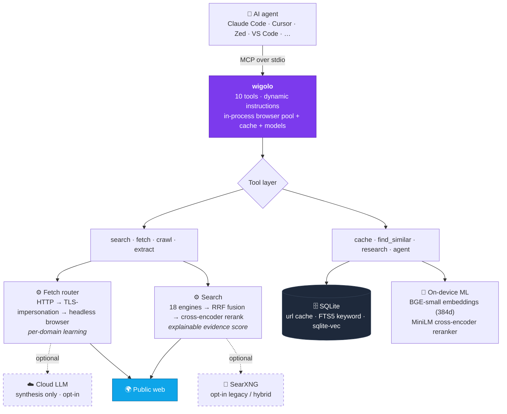

<div align="center">

# 🌐 wigolo

### The go-to web for your agent.

**Local-first web intelligence over MCP — no keys, no cloud, no metered bill.**

[](https://www.npmjs.com/package/@staticn0va/wigolo)
[](https://nodejs.org)
[](https://modelcontextprotocol.io)
[](#-license)
[](#-contributing)
[](https://buymeacoffee.com/knockoutez)

**[Quickstart](#-quickstart) · [Tools](#-the-tools) · [Architecture](#%EF%B8%8F-architecture) · [Setup](#-recommended-setup) · [Reference](#%EF%B8%8F-full-reference) · [Compare](#-how-it-compares) · [Contribute](#-contributing)**

</div>

---

wigolo runs on your machine as an MCP server and hands an AI coding agent one durable surface for everything web-related: **search, fetch, crawl, extract, cache, find-similar, research,** and autonomous gather loops. It needs no API keys to do its core work, and nothing it touches leaves `~/.wigolo/`.

The goal of the project is plain: web search and research for agents should be as good as the paid services — and stay open, local, and free — instead of being a meter you feed every time your agent gets curious. That's the bar it's held to.

```bash
npx @staticn0va/wigolo init --agents=claude-code   # wire it into your agent
npx @staticn0va/wigolo warmup --all                # so the first call isn't cold
```

---

## ⚡ Quickstart

You need **Node ≥ 20** and ~**1.5 GB** of free disk (headless browser, the reranker, the embedding model, and a cache that grows with use). macOS, Linux, Windows all work. Python is only needed if you opt into the legacy SearXNG backend.

```bash
# 1. install + wire into one or more agents (idempotent — safe to re-run)
npx @staticn0va/wigolo init --agents=claude-code

# 2. pre-download models so first calls are fast
npx @staticn0va/wigolo warmup --all

# 3. confirm everything's healthy (no network fetches)
npx @staticn0va/wigolo doctor
```

Or add it to any MCP client by hand:

```bash
claude mcp add wigolo -- npx @staticn0va/wigolo
```

Prefer to kick the tyres without an agent? There's a REPL:

```bash
wigolo shell
wigolo> search "rate limiter token bucket typescript" --category=code --limit=15
wigolo> fetch https://docs.python.org/3/library/functools.html --section=lru_cache
wigolo> research "Compare Bun, Deno, Node.js for HTTP servers" --depth=standard
```

---

## ✨ Why wigolo

- **Zero keys to start.** Default search talks to public engines through direct adapters; the reranker and embeddings run on-device. Useful within a minute of installing.
- **Local-first, private by default.** Cache, embeddings, models, and config live under `~/.wigolo/`. No telemetry unless you switch it on. Optional LLM keys are strictly additive — never required.
- **Built for agents, not humans.** Parallel multi-query fan-out (one call, many engines, in parallel — a serial host tool-loop can't match it), transparent per-result scoring, and budget-aware output.
- **Honest output.** Results flag stale cache, failed fetches, degraded backends, and truncated diffs instead of returning empty-but-successful-looking data.
- **One surface, eight jobs.** Search → fetch → crawl → extract → cache → find-similar → research → autonomous agent, all behind a single MCP connection.

It's **not** a hosted SaaS, **not** a vector database other apps query, and **not** a general web-automation framework. It does one thing: feed agents good web data, locally.

---

## 🧰 The tools

| Tool | What it does |
|------|--------------|
| 🔎 `search` | Multi-engine web search (18 direct engine adapters) with reciprocal-rank fusion, ML cross-encoder reranking, and an explainable per-result score. Pass a query **array** for parallel breadth. |
| 📄 `fetch` | Load one URL through a tiered router (HTTP → TLS-impersonation → headless browser) that auto-escalates on anti-bot challenges or SPA shells. Clean markdown + metadata + links + optional screenshot. |
| 🕸️ `crawl` | Multi-page crawl — BFS, DFS, sitemap, auto, or map-only. Per-domain rate limits, robots.txt respect, boilerplate dedup. |
| 🧩 `extract` | Structured data from a page: tables, metadata, JSON-LD, brand identity, named schemas (Article / Recipe / Product / …), or any custom JSON Schema. |
| 💾 `cache` | Query everything already seen — keyword (FTS5/BM25) or hybrid (BM25 + on-device vectors, fused). Plus stats, clear, and change detection. |
| 🧲 `find_similar` | Pages similar to a URL or a concept, via 3-way fusion of keyword + semantic + live web. |
| 🧠 `research` | Decompose a question → fan out sub-queries → fetch sources → synthesize a cited report (or emit a structured brief the host LLM can write from). |
| 🤖 `agent` | Autonomous gather loop: plan → search → fetch → extract → synthesize, with a step log, time budget, and optional output schema. |
| 🔁 `diff` / `watch` | Content change detection and URL polling (reserved; shipping incrementally). |

---

## 🏗️ Architecture

A single Node process speaking MCP (JSON-RPC over stdio). Everything heavy is local and lazy-loaded, so a zero-key install pays nothing for the parts it isn't using.



Four choices shape how it behaves:

- **Code beats model.** Deterministic work — URL canonicalization, rank fusion, dedup, schema matching, hashing — never goes to an LLM. The model is reserved for judgment (synthesis, filling schema fields the DOM can't), it's opt-in, and it's capped per request. When an LLM *does* fill a field, the value is checked against the source text and nulled if it isn't there — hallucinations don't reach your structured output.
- **Routing on observable signals.** The fetch ladder escalates to a real browser based on what it sees — SPA markers, anti-bot challenge bodies, thin content — not guesses about which domains are "probably JS-heavy." It learns per-domain, and unlearns when a site stops needing the browser.
- **Transparent ranking.** Every result carries a score breakdown (relevance × domain quality × lexical alignment × recency, plus consensus and authority) and a query-understanding block. You can audit why something ranked where it did.
- **No silent failure.** Stale cache, failed fetches, degraded backends, and truncation are surfaced in the result, not hidden.

---

## 🚀 Recommended setup

A clean install works. But a handful of settings noticeably change output quality. Set them as environment variables, or in your agent's MCP `env` block.

#### 1. Close the synthesis gap — the single biggest lever

The common hosts (Claude Code, Claude Desktop) don't expose MCP sampling, so `research`, `agent`, and `search format=answer` fall back to a plain source listing unless you point wigolo at an LLM:

```bash
# local — everything stays on your machine, no cloud, no cost:
export WIGOLO_LLM_PROVIDER=http://localhost:11434   # Ollama / vLLM / LM Studio

# or cloud — better-written synthesis, one cheap call per report:
export WIGOLO_LLM_PROVIDER=anthropic                # key goes to the OS keychain, never config.json
export WIGOLO_LLM_API_KEY=sk-...                    # key for whichever provider WIGOLO_LLM_PROVIDER names
```

For a cloud provider you can supply the key either via the provider-specific var
(`ANTHROPIC_API_KEY` / `OPENAI_API_KEY` / `GOOGLE_API_KEY` / `GROQ_API_KEY`) or via the
generic `WIGOLO_LLM_API_KEY`, which applies to whichever provider `WIGOLO_LLM_PROVIDER`
names. The provider-specific var wins when both are set.

For synthesizing already-retrieved evidence, a local 7–8B model is plenty. Reach for cloud only when you're shipping a report.

#### 2. Widen the retrieval funnel

Search quality is bounded by what the engines surface, so give them more to surface:

```bash
export WIGOLO_SEARCH=hybrid       # core engines + SearXNG fallback on the cases core alone misses
export BRAVE_API_KEY=...          # adds Brave to the pool; better fusion consensus
export WIGOLO_GITHUB_TOKEN=...    # GitHub code search 10 → 30 req/min, plus org-private results
```

#### 3. Land more fetches, keep things warm

```bash
export WIGOLO_TLS_TIER=auto       # per-domain TLS-impersonation; clears Cloudflare/DataDome without the cost on sites that don't need it
export WIGOLO_EAGER_WARMUP=1      # pays the ~1s ONNX load up front, not on first search
```

For repeated interactive use, run `wigolo serve` so the browser pool, embeddings, and reranker stay resident across calls.

#### Per-call habits that pay off

- **Query arrays** (`["a", "b", "c"]`) for breadth — the parallel fan-out is the thing a serial host loop can't replicate.
- **`search_depth: "deep"`** for queries that matter (adds evidence extraction + rerank on highlights); `balanced` is the everyday default.
- **`include_domains`** for docs/library lookups — it's a hard filter, not a hint.
- To warm `find_similar`, crawl a corpus first with **`WIGOLO_CRAWL_INDEX=1`**, then run `wigolo backfill`.

> **Want to stay 100% on-device?** The honest minimal set is a local LLM endpoint + `WIGOLO_TLS_TIER=auto` + `WIGOLO_EAGER_WARMUP=1`. Fully local, and the synthesis path still works.

---

## ⚙️ Full reference

Everything you can set, with a one-line description each. Collapsed to keep this readable — click to expand.

### CLI commands

| Command | What it does |
|---------|--------------|
| `wigolo` / `wigolo mcp` | Start the MCP stdio server (the default command). |
| `wigolo init` | First-run wizard — wires wigolo into your detected agents. `--non-interactive --agents=<csv>` for CI. |
| `wigolo setup mcp` | Re-write just the MCP server entries, without the full wizard. |
| `wigolo warmup [--all]` | Pre-download browser / reranker / embeddings; `--verify` runs a smoke test. |
| `wigolo doctor` | Cold-start health check — no network fetches. |
| `wigolo verify` | End-to-end smoke test (fetch, crawl, extract, search, rerank, embed). |
| `wigolo serve` | HTTP daemon — keeps subsystems warm across multiple clients. |
| `wigolo shell` | Interactive REPL (`--json` for piping). |
| `wigolo config` | Settings TUI; or headless `--set K=V`, `--export`, `--import`, `--cleanup`, `--uninstall --yes`. |
| `wigolo status` | Plain-text status summary. |
| `wigolo health` | Ping a running daemon's `/health`. |
| `wigolo backfill` | Embed cached pages that have no vector yet (`--batch-size`, `--dry-run`). |
| `wigolo plugin add\|list\|remove` | Manage custom extractor / search-engine plugins. |
| `wigolo uninstall` | Remove wigolo from agent configs (keeps your cache). |

<details>
<summary><b>🔎 Search &amp; engines</b></summary>

| Var | Default | Effect |
|-----|---------|--------|
| `WIGOLO_SEARCH` | `core` | `core` (direct engines) / `searxng` (legacy) / `hybrid` (core + searxng fallback). |
| `BRAVE_API_KEY` | — | When set, Brave joins the engine pool (env-only, never persisted). |
| `WIGOLO_GITHUB_TOKEN` | — | Lifts GitHub code search 10 → 30 req/min; enables org-private search (env-only). |
| `SEARXNG_URL` | — | External SearXNG URL; when set, skips local bootstrap. |
| `SEARXNG_MODE` | `native` | `native` (Python venv) or `docker`. |
| `SEARXNG_PORT` | `8888` | Port for native SearXNG. |
| `SEARXNG_QUERY_TIMEOUT_MS` | `8000` | Per-query timeout to the aggregator. |
| `WIGOLO_MULTI_QUERY_CONCURRENCY` | `5` | Max parallel (query × engine) tasks. |
| `WIGOLO_MULTI_QUERY_MAX` | `10` | Max unique queries after normalization. |
| `WIGOLO_QUERY_EXPAND_VARIANTS` | `5` | Heuristic query-expansion variants. |

</details>

<details>
<summary><b>📄 Fetch, network &amp; TLS</b></summary>

| Var | Default | Effect |
|-----|---------|--------|
| `USER_AGENT` | rotating Chrome UAs | Override the User-Agent header. |
| `FETCH_TIMEOUT_MS` | `10000` | HTTP request timeout. |
| `FETCH_MAX_RETRIES` | `2` | Retry budget for 429 / 502 / 503 / network errors. |
| `MAX_REDIRECTS` | `5` | Manual-mode redirect cap. |
| `PLAYWRIGHT_LOAD_TIMEOUT_MS` | `15000` | Browser `page.load` wait. |
| `PLAYWRIGHT_NAV_TIMEOUT_MS` | `30000` | Browser navigation timeout. |
| `SEARCH_FETCH_TIMEOUT_MS` | `15000` | Per-result hydration fetch in search. |
| `SEARCH_TOTAL_TIMEOUT_MS` | `30000` | Aggregate search budget. |
| `USE_PROXY` / `PROXY_URL` | `false` / — | Route fetch through a proxy. |
| `WIGOLO_TLS_TIER` | `off` | `off` / `auto` (per-domain learned) / `on` (always try TLS first). |
| `WIGOLO_TLS_BROWSER` | `chrome_142` | TLS fingerprint profile (`<browser>_<version>`). |
| `WIGOLO_TLS_SUCCESS_THRESHOLD` | `3` | Successes before a domain flips to TLS-first. |

</details>

<details>
<summary><b>🖥️ Browser pool &amp; auth</b></summary>

| Var | Default | Effect |
|-----|---------|--------|
| `MAX_BROWSERS` | `3` | Max concurrent contexts per browser type. |
| `BROWSER_IDLE_TIMEOUT` | `60000` | Idle context eviction (ms). |
| `BROWSER_FALLBACK_THRESHOLD` | `3` | HTTP failures on a domain before forcing the browser. |
| `WIGOLO_BROWSER_TYPES` | auto (all 3) | CSV of browsers to use (chromium, firefox, webkit). |
| `WIGOLO_CDP_URL` | — | Chrome DevTools endpoint for a remote / logged-in browser. |
| `WIGOLO_AUTH_STATE_PATH` | — | Playwright `storageState.json` (cookies / localStorage). |
| `WIGOLO_CHROME_PROFILE_PATH` | — | Full Chrome `User Data` dir (copied to temp per use). |

</details>

<details>
<summary><b>💾 Cache &amp; crawl</b></summary>

| Var | Default | Effect |
|-----|---------|--------|
| `CACHE_TTL_SEARCH` | `86400` | Search result cache TTL (s). |
| `CACHE_TTL_CONTENT` | `604800` | Page content cache TTL (7 days). |
| `WIGOLO_FAST_STALE_MAX_HOURS` | `24` | In `cache` mode, accept entries up to this age. |
| `WIGOLO_FAST_TIMEOUT_MS` | `800` | Tight timeout for cache-mode fallback fetches. |
| `CRAWL_CONCURRENCY` | `2` | Per-public-domain concurrent fetches. |
| `CRAWL_DELAY_MS` | `500` | Per-public-domain inter-request delay. |
| `CRAWL_PRIVATE_CONCURRENCY` | `10` | Per-private-domain concurrency (localhost / RFC1918). |
| `CRAWL_PRIVATE_DELAY_MS` | `0` | Per-private-domain delay. |
| `RESPECT_ROBOTS_TXT` | `true` | When false, robots.txt is not fetched. |
| `VALIDATE_LINKS` | `true` | When false, broken-link probe is skipped. |
| `WIGOLO_CRAWL_INDEX` | — | `1` → crawled pages enqueued for embedding. |
| `WIGOLO_WAIT_FOR_INDEX` | — | `1` → embedding queue runs synchronously per page. |

</details>

<details>
<summary><b>🧠 Reranker, embedding &amp; relevance</b></summary>

| Var | Default | Effect |
|-----|---------|--------|
| `WIGOLO_RERANKER` | `onnx` | `onnx` (cross-encoder) / `none` (consensus + authority + recency boosts only). |
| `WIGOLO_RERANKER_MODEL` | `Xenova/ms-marco-MiniLM-L-6-v2` | Cross-encoder model ID. |
| `WIGOLO_RERANKER_IDLE_TIMEOUT_MS` | `300000` | Hold the model warm 5 min after last use. |
| `WIGOLO_EMBEDDING_MODEL` | `BAAI/bge-small-en-v1.5` | Embedding model (384-dim). |
| `WIGOLO_EMBEDDING_IDLE_TIMEOUT` | `1800000` | Idle unload (30 min). |
| `WIGOLO_EMBEDDING_MAX_TEXT_LENGTH` | `8000` | Truncation before embedding. |
| `WIGOLO_RELEVANCE_THRESHOLD` | `0` | Min relevance for the agent's post-fetch filter. |
| `WIGOLO_FIND_SIMILAR_COLD_START_THRESHOLD` | `0.02` | Fused score below which `find_similar` emits `cold_start`. |

</details>

<details>
<summary><b>☁️ LLM integration (all optional)</b></summary>

| Var | Default | Effect |
|-----|---------|--------|
| `WIGOLO_LLM_PROVIDER` | — | `anthropic` / `openai` / `gemini` / `groq` / custom URL (Ollama, vLLM, LM Studio). |
| `WIGOLO_LLM_MODEL` | — | Universal model override. |
| `WIGOLO_LLM_MODEL_{ANTHROPIC\|OPENAI\|GEMINI\|GROQ}` | — | Per-provider model override (highest precedence). |
| `WIGOLO_LLM_MAX_CALLS_PER_REQUEST` | `1` | Hard ceiling on LLM calls per tool invocation. |
| `WIGOLO_LLM_CACHE_TTL_DAYS` | `7` | LLM response cache TTL. |
| `ANTHROPIC_API_KEY` / `OPENAI_API_KEY` | — | Read on every call; never persisted. |
| `GEMINI_API_KEY` / `GOOGLE_API_KEY` | — | Either name accepted. |
| `GROQ_API_KEY` | — | Same. |
| `WIGOLO_LLM_API_KEY` | — | Generic key for whichever provider `WIGOLO_LLM_PROVIDER` names. Last-resort env fallback — the provider-specific var above wins, and it is ignored during auto-detect (no explicit provider). |

Keys can also live in the OS keychain or an AES-encrypted file (`wigolo init` / `wigolo config`) — never in `config.json`.

</details>

<details>
<summary><b>🔧 Daemon, warmup, paths, logging &amp; misc</b></summary>

| Var | Default | Effect |
|-----|---------|--------|
| `WIGOLO_DATA_DIR` | `~/.wigolo` | Root for cache, models, keys, plugins, SearXNG venv. |
| `WIGOLO_CONFIG_PATH` | `${DATA_DIR}/config.json` | Persisted config path. |
| `WIGOLO_DAEMON_PORT` | `3333` | Listen port for `wigolo serve`. |
| `WIGOLO_DAEMON_HOST` | `127.0.0.1` | Bind address. |
| `WIGOLO_EAGER_WARMUP` | — | `1` → pre-warm embed + rerank on startup (fire-and-forget). |
| `WIGOLO_BOOTSTRAP_MAX_ATTEMPTS` | `3` | SearXNG bootstrap retry limit. |
| `WIGOLO_HEALTH_PROBE_INTERVAL_MS` | `30000` | Background backend-health probe period. |
| `WIGOLO_PLUGINS_DIR` | `${DATA_DIR}/plugins` | Plugin discovery root. |
| `LOG_LEVEL` | `info` | `debug` / `info` / `warn` / `error`. |
| `LOG_FORMAT` | `json` | `json` or human-friendly `text`. |
| `WIGOLO_TELEMETRY` | — | `1` → local NDJSON event log (off by default, no PII). |
| `WIGOLO_TELEMETRY_ENDPOINT` | — | Also POST events fire-and-forget to this URL. |
| `WIGOLO_TUI_REDUCED_MOTION` | — | `1` → disable TUI spinners / animations. |

</details>

<details>
<summary><b>🎛️ Common per-call options (tool arguments)</b></summary>

| Option | Tools | Notes |
|--------|-------|-------|
| `mode` | fetch, search, crawl, extract, find_similar | `cache` (fast, stale-OK) / `default` (smart routing) / `stealth` (full browser, no cache). |
| `search_depth` | search | `ultra-fast` (cache only) / `fast` / `balanced` (default) / `deep` (evidence + rerank highlights). |
| `query` | search | `string` or `string[]` — arrays fan out in parallel. |
| `include_domains` / `exclude_domains` | search, find_similar, research | Hard whitelist / blacklist (host-suffix match). |
| `format` | search | `answer` / `stream_answer` — triggers LLM synthesis with citations. |
| `citation_format` | search, crawl, research, agent | `numbered` / `json` / `anthropic_tags`. |
| `time_range` / `from_date` / `to_date` | search | Recency bounds. |
| `render_js` | fetch | `auto` / `always` / `never`. |
| `use_auth` | fetch, crawl | Route through configured auth (CDP > Chrome profile > storage state). |
| `actions` | fetch | Sequential browser actions (`click`, `type`, `wait`, `wait_for`, `scroll`, `screenshot`). |
| `section` | fetch | Extract a markdown subtree at a heading. |
| `strategy` | crawl | `bfs` / `dfs` / `sitemap` / `auto` / `map`. |
| `mode` (extract) | extract | `selector` / `tables` / `metadata` / `schema` / `structured` / `brand`. |
| `named_schema` | extract | `Article` / `Recipe` / `Product` / `CodeSnippet` / `Paper` / `EventListing`. |
| `depth` | research | `quick` / `standard` / `comprehensive`. |
| `max_pages` / `max_time_ms` | agent | Per-invocation page cap (default 3) and wall-clock budget. |
| `max_tokens_out` | most | Aggregate output-token budget (default 4000). |
| `include_full_markdown` | fetch, crawl, research, agent | `false` → evidence excerpts instead of full bodies. |

</details>

---

## 📊 How it compares

There's a healthy field of agent-search tools now, and they're good — this isn't a takedown, it's an honest map of where the tradeoffs land. Short version: the hosted services win on scale (global neural indexes, anti-bot infrastructure, zero ops); wigolo wins on locality, privacy, and marginal cost.

| Dimension | **wigolo** | Tavily | Exa | Firecrawl | Perplexity Sonar | Crawl4AI |
|-----------|:----------:|:------:|:---:|:---------:|:----------------:|:--------:|
| **Where it runs** | your machine (`npx`) | hosted | hosted | hosted / self-host (Docker+DB) | hosted | your machine |
| **Cost per query** | **$0** | ~$0.008 after free tier | ~$49/mo+ | self-host free / $19+/mo | per-request + per-token | **$0** |
| **Works with no key** | ✅ | ❌ | ❌ | self-host only | ❌ | ✅ |
| **License** | source-available (NC) | closed | closed | AGPL-3.0 | closed | Apache-2.0 |
| **Web recall** | metasearch (18 engines) | aggregated index | neural index, 100s of M pages | crawl-driven | grounded index | — (you bring the search) |
| **Semantic find-similar** | ✅ local | ❌ | ✅ signature feature | ❌ | ❌ | ❌ |
| **Crawl + extract** | ✅ | partial | partial | ✅ core strength | ❌ | ✅ core strength |
| **Synthesized cited answers** | ✅ opt-in LLM | ✅ | ✅ | ✅ agent endpoint | ✅ its whole job | ❌ |
| **Local persistent cache** | ✅ free re-queries | ❌ | ❌ | ❌ | ❌ | ❌ |
| **Data stays on device** | ✅ | ❌ | ❌ | self-host only | ❌ | ✅ |
| **Best at** | private, low-cost technical research | fastest hosted RAG setup | semantic discovery | hostile-site crawling at scale | one-call answers | DIY crawl pipelines |

<sub>Pricing moves — verify current numbers with each provider. Recent shifts: Tavily was acquired by Nebius (Feb 2026); Brave Search API retired its perpetual free tier (Feb 2026). Most competitors now ship an MCP server too — but for the hosted ones, your queries and fetched content still travel to their cloud, which is the line the "data stays on device" row really draws.</sub>

**Where the others are clearly ahead, and wigolo isn't pretending otherwise:** Exa owns semantic discovery (a global neural index wigolo can't match cold); Firecrawl has a maintained anti-bot layer for crawling hostile sites at volume; Perplexity Sonar returns a finished cited answer in a single call. **Where wigolo fits:** privacy- or cost-sensitive work, technical research, repeated queries (the local cache makes re-querying free), and agents that benefit from parallel multi-query fan-out — without a bill that grows with how much your agent thinks.

---

## 🤝 Contributing

Bug reports, feature requests, PRs, and ideas are all welcome — this is the kind of project that gets better with more eyes on it.

- **Found a bug or want a feature?** [Open an issue](https://github.com/KnockOutEZ/wigolo/issues).
- **Sending a PR?** Go for it. Keep tool handlers thin (business logic lives in the domain modules), run the test suite, and follow the existing conventions.
- **Want to extend it?** wigolo has a plugin system for custom extractors and search engines — `wigolo plugin add <git-url>`.

If something's unclear, ask in an issue. No contribution is too small.

---

## ☕ Support the project

wigolo is open and free, and I intend to keep it that way — maintained, not abandoned, and never turned into a paywalled API. If it saves you a metered search bill, consider chipping in so the upkeep stays sustainable:

<div align="center">

### **[☕ Buy me a coffee →](https://buymeacoffee.com/knockoutez)**

</div>

Sponsorship of any size helps. So does a ⭐, a sharp bug report, or a good PR.

---

## 📜 License

Source-available under **PolyForm Noncommercial 1.0.0** — free to use, modify, and self-host for any noncommercial purpose. For commercial use, or any question or concern about the license, please reach out; I'm happy to talk it through.

## 📬 Contact

Licensing, commercial use, concerns about the project, or anything that doesn't fit a GitHub issue:

📧 **ktowhid20@gmail.com**

---

<div align="center">
<sub>Built and maintained by <a href="https://github.com/KnockOutEZ">@KnockOutEZ</a>. If wigolo is useful to you, the best thanks is a ⭐, an issue, or a coffee.</sub>
</div>